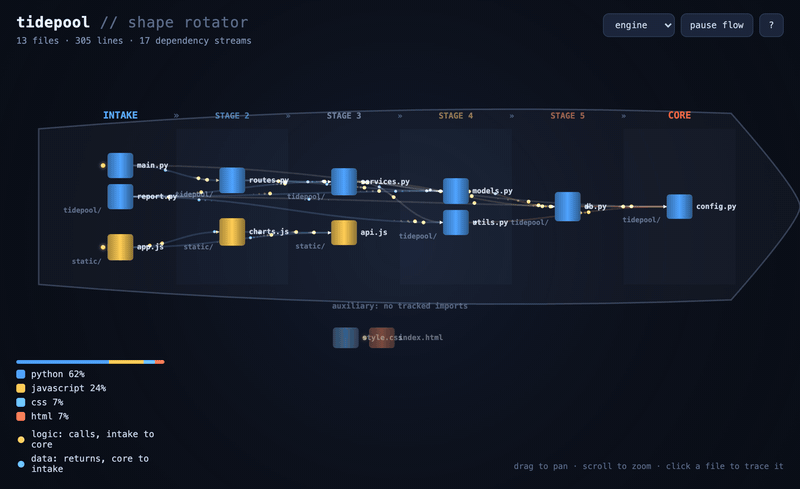
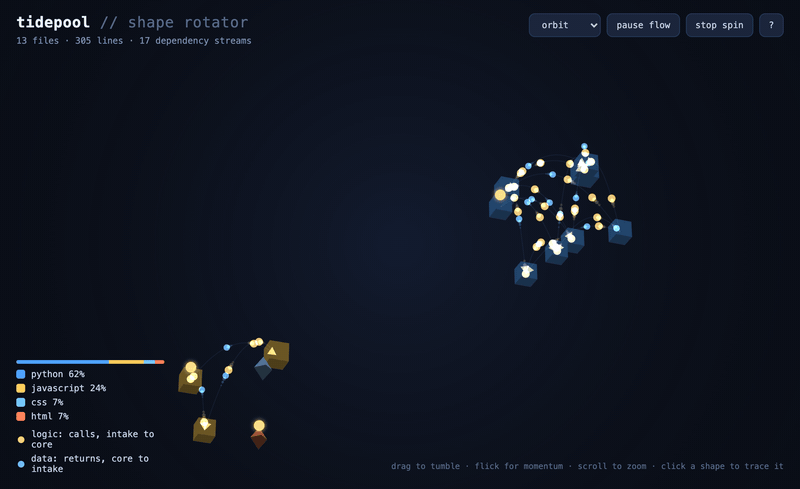
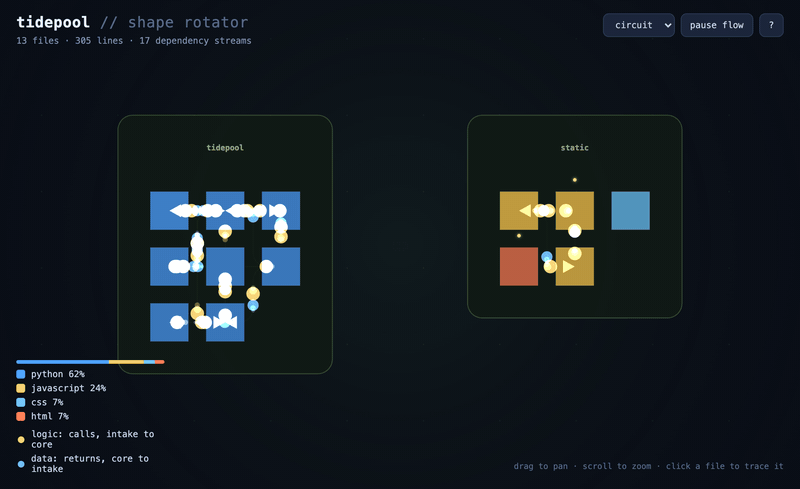
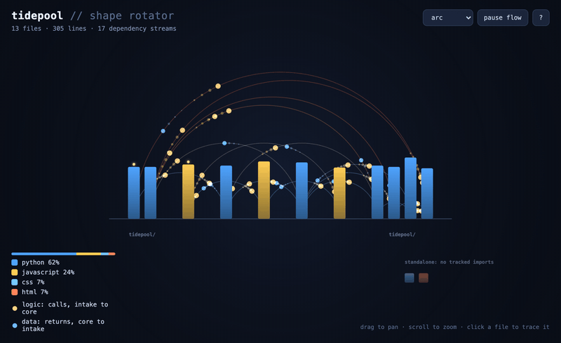
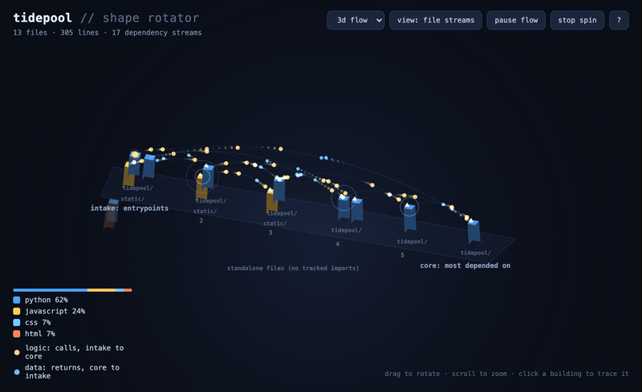

# shape-rotator

Turn a codebase into an interactive machine diagram that shows how the
program works, from inputs to outputs, the way a cutaway drawing shows a
jet engine.

shape-rotator reads a repo's import graph, stages every file by dependency
depth (entrypoints at the intake, the most-depended-on modules in the core),
and writes a single self-contained HTML file with five switchable views.
The captures below are the bundled [demo project](demo/tidepool).

## The five views

### engine (default)

A jet-engine cross-section. Phase bands run left to right, labeled INTAKE,
STAGE n, and CORE. Files sit in blade rows grouped by folder. Dependency
ribbons heat up from blue to red as flow moves deeper, and back-edges loop
under the engine as a dashed bypass duct.



### orbit

A 3D constellation. Each folder is a cluster of solids on a sphere. Drag
to any angle, flick for momentum.



### circuit

A circuit board. Folders are chips, files are pads, imports are copper
traces carrying pulses.



### arc

An arc diagram. Files sit on a baseline ordered by stage; forward imports
arc above it and back-edges dip below.



### pipeline

The staged model as a rotatable 3D scene with particles running the
imports.



## Logic and data

Every view draws two flows on the same edges. Gold pulses are logic: calls
running from importer to imported, the direction the arrowheads point. Blue
droplets are data: results returning the other way. Click a file to trace
it; the scene dims, its dependencies light up cyan, its dependents light up
orange, and a side panel lets you walk the graph file by file. A legend
shows how much of the codebase each language accounts for.

The output is one HTML file that loads nothing from the network and needs
no build step. It works offline and in sandboxed viewers.

## Try it in 30 seconds

A small fictional codebase ships in [`demo/tidepool`](demo/tidepool) (an
aquarium-monitoring app), along with a pre-built visualization:

```bash
open demo/tidepool-codeflow.html
```

Or rebuild it yourself:

```bash
python3 scripts/analyze_codebase.py demo/tidepool -o codebase.json
python3 scripts/build_visualization.py codebase.json -o codeflow.html --open
```

Then point the same two commands at your own repo. The scripts run on
Python 3.8 or newer with nothing to install.

## Use it as a Claude Code skill

This repo is a [Claude Code](https://claude.com/claude-code) skill
([`SKILL.md`](SKILL.md)). Install it into your personal skills directory:

```bash
git clone https://github.com/briwilcox/shape-rotator ~/.claude/skills/shape-rotator
```

Then ask, in any Claude Code session:

> shape rotate this repo

> visualize how data flows through my codebase

Claude runs the analyzer, builds the visualization, opens it, and explains
what the shape says about your program: what sits at the intake, how deep
the flow runs, and what everything drains into.

## CLI reference

```bash
python3 scripts/analyze_codebase.py /path/to/repo -o codebase.json [--max-files 400]
python3 scripts/build_visualization.py codebase.json -o codeflow.html [--open] [--view MODE]
```

- `--view engine|orbit|circuit|arc|pipeline` sets the opening view. All
  five ship in every output, and a menu switches between them.
- `--max-files N` caps very large repos to the N largest files.
- To visualize one package of a monorepo, pass that subdirectory as the root.

## How it works

`analyze_codebase.py` walks the repo, skipping `.git`, `node_modules`,
virtualenvs, and build dirs. It measures every recognized source file and
extracts import edges with per-language regexes for Python, JavaScript,
TypeScript, Go, Rust, Ruby, Java, and PHP. It condenses import cycles
(Tarjan SCC), then stages files by longest path through the dependency DAG.

`build_visualization.py` injects the resulting JSON into
`assets/viewer_template.html`, which renders everything with hand-rolled
canvas code in one file.

Import extraction is regex-based and best-effort. Languages without
patterns (C, C++, C#, Swift) still render as structures, but without flow.
Adding a language takes one regex in `IMPORT_PATTERNS`; resolution to
in-repo files is automatic, and PRs are welcome.

Outputs contain only paths relative to the repo you analyze, never
absolute machine paths, so they are safe to share.

## License

[MIT](LICENSE)
